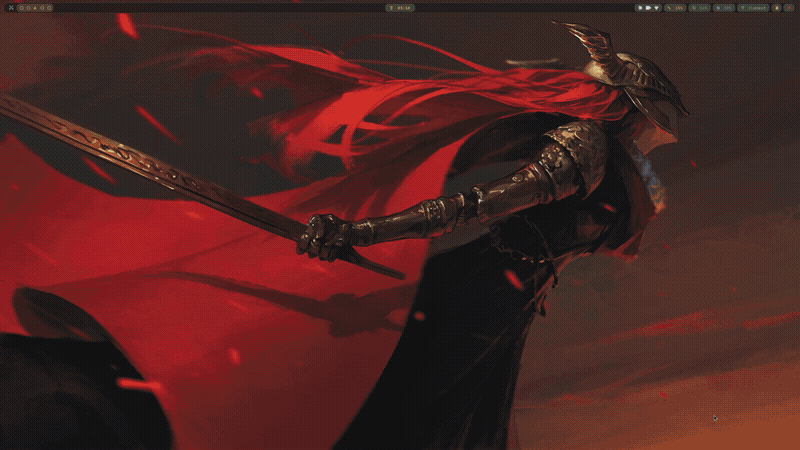

# hypr-rice

A Hyprland rice with **one-click switchable game themes**. Pick a theme and
*everything* follows: wallpaper, window borders, terminal colors, waybar
(colors *and* icons), lock screen, notification center, your folder icon tint, and even the app icons
in the launcher (regenerated as duotone game-palette icons per theme).



*(full-quality video: [demo.mp4](demo.mp4))*

## Themes

| Theme | Vibe | Waybar identity |
|---|---|---|
|  **elden-ring** | Erdtree gold on deep umber *(default)* | crossed swords, embers, hourglass |
|  **ashen-flame** | dark fiery reds | flames, flask |
|  **god-of-war** | Norse gold & frost, Kratos art | axe, sword, shield |
|  **fallout** | Pip-Boy green terminal | radioactive, radio tower |
|  **cyberpunk-2077** | Night City black & construct yellow | samurai skull, chips, lightning |
|  **tokyo-night** | indigo night city | torii gate, crescent moon |
|  **gruvbox** | warm retro amber | coffee + classic icons |
|  **catppuccin-mocha** | pastel mauve | cat, paw, Pac-Man workspaces |

Each theme has its **own wallpaper collection** — cycling never leaks another
theme's wallpapers — and an extra **auto mode** extracts a palette from
whatever wallpaper is currently showing.

## Keybinds (highlights)

| Keys | Action |
|---|---|
| `Super+T` | Theme switcher menu |
| `Super+←/→` | Previous / next wallpaper *within the current theme* |
| `Super+Return` | Terminal (alacritty, frosted-glass blur) |
| `Super+Space` | Launcher (walker) |
| `Super+E` | File manager (thunar, theme-tinted folder icons) |
| `Super+L` | Lock screen (hyprlock, themed) |
| `Super+Alt+←/→`, `Super+↑/↓` | Move window focus |
| `Print` / `Shift+Print` | Region / window screenshot |

## Install

**Requirements:** Arch Linux, Hyprland ≥ 0.55 (the config is Lua —
`hyprland.lua`), an internet connection, and `sudo`.

```bash
git clone https://github.com/404-not-found129/hypr-rice.git && cd hypr-rice
chmod +x install.sh
./install.sh
```

The installer:

1. Installs official packages with pacman and AUR packages
   (`aether`, `walker`, `wlogout`, …) with yay/paru — bootstrapping `yay`
   if you have neither.
2. **Backs up** any configs it would overwrite to `~/.config-backup-<date>/`.
3. Copies configs, scripts, and systemd user drop-ins into place.
4. Installs the bundled wallpaper collections (all 8 themes), then fetches
   anything missing from wallhaven as a fallback.
5. Sets up folder-icon tinting (papirus-folders + an ACL so no password
   prompts on theme switch).
6. Seeds the default theme (elden-ring).

It is **idempotent** — safe to re-run (e.g. to retry failed wallpaper
downloads).

Afterwards, log into Hyprland and press `Super+T` to apply your first theme.

## How it works

- **[Aether](https://github.com/bjarneo/aether)** extracts/applies color
  palettes. Themes are Aether *blueprints* (`config/aether/blueprints/*.json`).
- A **post-apply hook** (`config/aether/custom/hypr-wallpaper/post-apply.sh`)
  runs after every apply: it re-points the wallpaper symlink, drives the
  `awww` wallpaper daemon, reloads Hyprland (borders re-read the palette via
  Lua), swaps waybar's per-theme icons, reloads waybar, tints Papirus folder
  icons to the accent color, and regenerates the app-icon set (see below).
- **`bin/game-icons`** renders every installed app's icon as a duotone mapped
  onto the theme's palette, installs it as a real icon theme
  (`~/.local/share/icons/Aether-Game-<theme>`), and points both
  `gtk-icon-theme-name` in `~/.config/gtk-{3,4}.0/settings.ini` **and**
  `gsettings` at it. Both are needed: this setup has no XSettings daemon
  (no `gnome-settings-daemon`/`xsettingsd`) to bridge `gsettings` into
  running GTK apps, so without the `settings.ini` patch the icon theme only
  ever *looks* applied but nothing on screen changes.
- **`bin/themeswitch`** (Super+T) is a walker menu over the blueprints; it
  records the active theme and mirrors that theme's wallpapers into
  `~/Wallpapers` so the Aether GUI's local browser only shows on-theme ones.
- **`bin/wallcycle`** (Super+←/→) cycles the active theme's collection through
  `aether --generate`, so colors re-extract per wallpaper. A shared lock keeps
  the two scripts from ever running two applies at once.
- **`bin/waybar-theme-icons`** patches waybar's config with each theme's icon
  set (all glyphs verified against JetBrainsMono Nerd Font).

### Add wallpapers to a theme

Drop images into `~/Pictures/wallpapers/collections/<theme>/` — they're picked
up automatically by both the cycler and the GUI mirror.

### Add a new theme

Create a blueprint JSON in `~/.config/aether/blueprints/` (copy an existing
one), make a matching wallpaper folder in
`~/Pictures/wallpapers/collections/<name>/`, and optionally add an icon set in
`bin/waybar-theme-icons`. It appears in Super+T automatically.

## Troubleshooting

- **Folder icons stop changing color** — a `papirus-icon-theme` package update
  reset the permissions. Re-run:
  `sudo setfacl -R -m u:$USER:rwX /usr/share/icons/Papirus*`
- **Wallpaper didn't change with the theme** — the wallpaper daemon may not be
  running; check `pgrep awww-daemon`, and note Hyprland autostarts it at login.
- **`hyprctl dispatch` errors about Lua** — with the Lua config plugin,
  dispatch arguments are Lua (`hyprctl dispatch 'hl.dsp.exit()'`), not the
  classic syntax.
- **A wallpaper failed to download** — wallhaven throttles sometimes; re-run
  `./install.sh`, it skips what already exists.
- **App icons don't change with the theme** — something (nwg-look,
  lxappearance, a distro default) may have put a hardcoded
  `gtk-icon-theme-name=` line back in `~/.config/gtk-3.0/settings.ini` or
  `gtk-4.0/settings.ini` after `game-icons` set it. Re-running any theme
  switch (`Super+T`) rewrites that line back to the active theme's icon set.

## Credits

- [Aether](https://github.com/bjarneo/aether) by Bjarne Overli — theming engine
- [papirus-folders](https://github.com/PapirusDevelopmentTeam/papirus-folders)
- Wallpapers from [wallhaven.cc](https://wallhaven.cc); game artwork belongs
  to its respective owners

## License

MIT — see [LICENSE](LICENSE).
