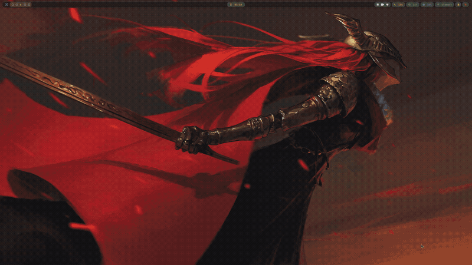

# hypr-rice

A Hyprland rice with **one-click switchable themes** -- game-inspired ones
*and* classic editor/aesthetic palettes (Nord, Rosé Pine, Everforest,
Kanagawa, Dracula, Catppuccin Latte, ...), including a **light theme**. Pick a theme and
*everything* follows: wallpaper, window borders, terminal colors, waybar
(colors *and* icons), lock screen, notification center, your folder icon
tint, the mouse cursor set, and even the app icons in the launcher --
each theme draws its own badge frame, and every app in the launcher gets
one of a *pool* of small original emblems for that theme (sword, shield,
coin, flask, gear, sprig, axe, torii gate, radiation trefoil, paw print,
...) picked per-app so the set reads as a real varied icon pack, not one
mark repeated everywhere -- gradient-shaded, supersampled for crisp
edges, with a soft drop shadow. All original artwork: no ripped game
assets, just generic shapes (a sword, a coin, a torii gate, the public
radiation symbol) evocative of each game without copying anyone's
specific art.



*(full-quality video: [demo.mp4](demo.mp4))*

## Themes

**Games**

| Theme | Vibe | Waybar identity |
|---|---|---|
|  **elden-ring** | Erdtree gold on deep umber *(default)* | crossed swords, embers, hourglass |
|  **ashen-flame** | dark fiery reds | flames, flask |
|  **god-of-war** | Norse gold & frost, Kratos art | axe, sword, shield |
|  **fallout** | Pip-Boy green terminal | radioactive, radio tower |
|  **cyberpunk-2077** | Night City black & construct yellow | samurai skull, chips, lightning |

**Aesthetic**

| Theme | Vibe | Waybar identity |
|---|---|---|
| 󰜗 **nord** | arctic, north-bluish calm | snowflakes, peaks, waves |
| 󰉊 **rose-pine** | soho-vibes rose & iris on deep night | flowers, crescent moon |
| 󰐅 **everforest** | soft forest greens, easy on the eyes | pines, leaves, sprouts |
| 󰞍 **kanagawa** | ukiyo-e wave blue & carp gold | waves, fish, anchor, hanko seal badge |
| 󰭟 **dracula** | the classic purple & pink | bats, spider, coffin |
| 󰅶 **catppuccin-latte** | pastel *light* theme | coffee, tea, cake |
|  **catppuccin-mocha** | pastel mauve | cat, paw, Pac-Man workspaces |
|  **tokyo-night** | indigo night city | torii gate, crescent moon |
|  **gruvbox** | warm retro amber | coffee + classic icons |

Groups live in `~/.config/hypr-rice/categories`; the picker shows them as
separate sections and `themectl random games` / `themectl random aesthetic`
picks within one.

Each theme has its **own wallpaper collection** — cycling never leaks another
theme's wallpapers — and an extra **auto mode** extracts a palette from
whatever wallpaper is currently showing.

## Keybinds (highlights)

Press **`Super+/`** for the full, searchable list (read live from your
`hyprland.lua`, so it never goes stale -- pick an entry to run it).

| Keys | Action |
|---|---|
| `Super+T` | Visual theme picker (sections, click / arrows / 1-9, `R` = random) |
| `Super+Shift+T` | Random theme |
| `Super+Ctrl+T` | Theme from the current wallpaper (auto palette) |
| `Super+←/→` | Previous / next wallpaper *within the current theme* |
| `Super+Shift+W` | Random wallpaper from the current theme |
| `Super+N` | Night light on/off (hyprsunset) |
| `Super+Shift+R` / `Super+Alt+R` | Record a region / the screen (press again to stop) |
| `Super+.` | Emoji & symbol picker |
| `Super+,` | Settings app |
| `Super+Return` | Terminal (alacritty, frosted-glass blur) |
| `Super+Space` | Launcher (walker) |
| `Super+E` | File manager (thunar, theme-tinted folder icons) |
| `Super+L` | Lock screen (hyprlock, themed) |
| `Super+Alt+←/→`, `Super+↑/↓` | Move window focus |
| `Print` / `Shift+Print` | Region / window screenshot |

## Extras

- **Settings app (`Super+,`, or right-click the bar logo).** One window for
  the theme and wallpaper, gaps / borders / rounding / blur / animations /
  opacity (applied live), the day/night schedule, night-light temperature, a
  searchable keybind list, and versions/folders. `rice-settings <page>` opens
  a specific page (`appearance`, `look`, `schedule`, `nightlight`,
  `keybinds`, `about`). Look & feel is stored in
  `~/.config/hypr-rice/look.lua`, which `hyprland.lua` reads.
- **fastfetch** uses a grouped, boxed layout (system / desktop / hardware /
  session, including the active rice theme) in the style of fastfetch's own
  presets. Its colors are terminal palette slots, so it follows the theme.
- **Light/dark follows the theme.** Pick a light theme (catppuccin-latte) and
  GTK/libadwaita apps, Firefox/Chromium and Electron apps switch to light
  mode too; dark themes switch them back. Decided from the palette itself, so
  it also works for *auto* themes pulled from a bright wallpaper.
- **Day/night schedule.** `theme-schedule on` applies a day theme after
  sunrise and a night theme after sunset (defaults: catppuccin-latte /
  rose-pine at 07:00 / 19:00 -- edit `~/.config/hypr-rice/schedule`). Picking
  a theme by hand is respected until the next sunrise/sunset.
  `theme-schedule off` / `status`.
- **`themectl`** -- scriptable theme control:
  `themectl list | current | set <theme> | random [games|aesthetic] | next | prev | auto`.
- **Waybar additions:** now-playing (mpris, scroll to skip), caffeine
  (idle-lock inhibitor), night light, battery, backlight and bluetooth
  (auto-hidden when the hardware isn't there), a recording indicator that
  only appears while recording (click to stop), and a theme button
  (click: picker, right-click: random, middle-click: from wallpaper).
- **Screen recordings** land in `~/Videos/recordings`, with a notification
  when saved.

## Install

**Requirements:** Arch Linux, Hyprland ≥ 0.55 (the config is Lua —
`hyprland.lua`), an internet connection, and `sudo`.

```bash
git clone https://github.com/404-not-found129/hypr-rice.git && cd hypr-rice
chmod +x install.sh
./install.sh
```

The installer:

1. Installs official packages with pacman and AUR packages
   (`aether`, `walker`, `wlogout`, …) with yay/paru — bootstrapping `yay`
   if you have neither.
2. **Backs up** any configs it would overwrite to `~/.config-backup-<date>/`.
3. Copies configs, scripts, and systemd user drop-ins into place.
4. Installs the bundled wallpaper collections (all 14 themes), then fetches
   anything missing from wallhaven as a fallback.
5. Sets up folder-icon tinting (papirus-folders + an ACL so no password
   prompts on theme switch).
6. Seeds the default theme (elden-ring).

It is **idempotent** — safe to re-run (e.g. to retry failed wallpaper
downloads).

Afterwards, log into Hyprland and press `Super+T` to apply your first theme.

**Updating:** `git pull && ./install.sh` -- your `~/.config/hypr-rice/`
settings (theme groups, schedule) are never overwritten.

## How it works

- **[Aether](https://github.com/bjarneo/aether)** extracts/applies color
  palettes. Themes are Aether *blueprints* (`config/aether/blueprints/*.json`).
- A **post-apply hook** (`config/aether/custom/hypr-wallpaper/post-apply.sh`)
  runs after every apply: it re-points the wallpaper symlink, drives the
  `awww` wallpaper daemon, reloads Hyprland (borders re-read the palette via
  Lua), swaps waybar's per-theme icons, reloads waybar, tints Papirus folder
  icons to the accent color, and regenerates the app-icon set (see below).
- **`bin/game-icons`** draws a per-theme badge/frame motif (distinct per
  game, not a recolor — see the table above for the vibe) and composites
  every installed app's real, unmodified icon on top, installing the result
  as a real icon theme (`~/.local/share/icons/Aether-Game-<theme>`). Points both
  `gtk-icon-theme-name` in `~/.config/gtk-{3,4}.0/settings.ini` **and**
  `gsettings` at it. Both are needed: this setup has no XSettings daemon
  (no `gnome-settings-daemon`/`xsettingsd`) to bridge `gsettings` into
  running GTK apps, so without the `settings.ini` patch the icon theme only
  ever *looks* applied but nothing on screen changes.
- **`bin/game-cursors`** recolors the open-source Breeze cursor SVGs to a
  two-tone palette derived from the theme accent and builds multi-size
  (24/32/48) Xcursor files, cached per theme and exposed via a stable
  `Aether-Cursor` symlink. Drop a 32x32 `default.png` into
  `~/.local/share/hypr-rice-personal/cursor-overrides/<theme>/` to use a
  personal arrow cursor for a theme (kept out of this repo). All eight
  sets are pre-built at install time (`game-cursors --build <theme>`), so
  switching never waits on generation. Note: apps already running when
  you switch keep their old cursors until restarted (Wayland apps load
  cursor themes at startup).
- **`bin/theme-picker`** (Super+T) is a floating GTK4 grid of theme cards,
  split into *games* and *aesthetic* sections -- wallpaper preview, palette
  swatches, a sun mark on light themes, active theme highlighted -- styled by
  the current theme's own colors. Click a card, use arrow keys + Enter, or
  press 1-9; `R` picks a random theme; Esc closes; Super+T again toggles. It runs as a resident
  service (autostarted by Hyprland) with cached wallpaper thumbnails, so
  the window appears in ~0.3s instead of paying GTK startup + 4K image
  decode on every open. (`bin/themeswitch` remains as a plain walker-dmenu
  fallback.) Both apply through **`bin/themectl`**, the single entry point
  that takes the apply lock, records the active theme and runs Aether. The active theme's wallpapers are mirrored into `~/Wallpapers`
  so the Aether GUI's local browser only shows on-theme ones.
- **`bin/wallcycle`** (Super+←/→) cycles the active theme's collection through
  `aether --generate`, so colors re-extract per wallpaper. A shared lock keeps
  the two scripts from ever running two applies at once.
- **`bin/waybar-theme-icons`** patches waybar's config with each theme's icon
  set (all glyphs verified against JetBrainsMono Nerd Font).
- **`bin/color-scheme-sync`** (post-apply) sets the freedesktop
  `color-scheme` and GTK's `prefer-dark-theme` from the palette's background
  luminance.
- **`bin/nightlight`**, **`bin/screenrec`**, **`bin/keybinds`** and
  **`bin/theme-schedule`** (+ `theme-schedule.timer`, a systemd user timer
  that is *off* until you run `theme-schedule on`) back the extras above.
- **`bin/eza-theme`** writes an `EZA_COLORS` string from the theme accent to
  `~/.config/eza/colors.sh` (sourced by `.bashrc`), so `ls`/`ll`/`la` (aliased
  to [eza](https://github.com/eza-community/eza) with icons + git columns)
  tint their size/date/owner/dir columns to match the active theme.

### Add wallpapers to a theme

Drop images into `~/Pictures/wallpapers/collections/<theme>/` — they're picked
up automatically by both the cycler and the GUI mirror.

### Add a new theme

Create a blueprint JSON in `~/.config/aether/blueprints/` (copy an existing
one; set `"lightMode": true` for a light palette), make a matching wallpaper
folder in `~/Pictures/wallpapers/collections/<name>/`, and optionally add an
icon set in `bin/waybar-theme-icons`. It appears in Super+T automatically, in
the *aesthetic* section unless you list it as `games` in
`~/.config/hypr-rice/categories`. Its launcher icons get a neutral badge
(stars, coins, hearts, gears) until you give it its own entry in
`bin/game-icons`.

## Troubleshooting

- **Theme switcher records the theme but nothing on screen changes (Omarchy
  installed)** -- Aether 4.x applies themes as native Omarchy themes whenever
  it sees Omarchy's commands, skipping this rice's templates and post-apply
  hook. All rice scripts call `bin/aether-run`, which runs Aether with the
  `omarchy*` commands hidden so it stays in standalone mode. If you launch the
  Aether GUI directly, start it as `aether-run` for the same reason.

- **Folder icons stop changing color** — a `papirus-icon-theme` package update
  reset the permissions. Re-run:
  `sudo setfacl -R -m u:$USER:rwX /usr/share/icons/Papirus*`
- **App icons in the launcher look default/unbadged** — in this setup, walker's
  GTK4 icon widgets don't reliably honor `gtk-icon-theme-name` for rendering
  (confirmed with a direct `Gtk.IconTheme.lookup_icon()` call, which resolves our
  theme correctly even when walker's own icons don't). `game-icons` works around
  this by also mirroring every generated icon straight into
  `~/.local/share/icons/hicolor/{64x64,128x128}/apps/` -- the universal fallback
  every toolkit checks regardless of the active theme setting -- on every apply.
- **Wallpaper didn't change with the theme** — the wallpaper daemon may not be
  running; check `pgrep awww-daemon`, and note Hyprland autostarts it at login.
- **`hyprctl dispatch` errors about Lua** — with the Lua config plugin,
  dispatch arguments are Lua (`hyprctl dispatch 'hl.dsp.exit()'`), not the
  classic syntax.
- **A wallpaper failed to download** — wallhaven throttles sometimes; re-run
  `./install.sh`, it skips what already exists.
- **App icons don't change with the theme** — something (nwg-look,
  lxappearance, a distro default) may have put a hardcoded
  `gtk-icon-theme-name=` line back in `~/.config/gtk-3.0/settings.ini` or
  `gtk-4.0/settings.ini` after `game-icons` set it. Re-running any theme
  switch (`Super+T`) rewrites that line back to the active theme's icon set.

## Credits

- [Aether](https://github.com/bjarneo/aether) by Bjarne Overli — theming engine
- [papirus-folders](https://github.com/PapirusDevelopmentTeam/papirus-folders)
- Wallpapers from [wallhaven.cc](https://wallhaven.cc); game artwork belongs
  to its respective owners

## License

MIT — see [LICENSE](LICENSE).
